# 结构化摘要

## AI 核心概念综述
[00:00:00] AI 圈子里每天都在冒新名词：LLM、Token、Context、Prompt、Tool、MCP、Agents、Agent Skill。本视频将从最底层的工程视角出发，将这些概念拆解清楚。

## LLM：大语言模型及其起源
[00:00:26] 最底层的是 LLM，全称 Large Language Model（大语言模型）。目前几乎所有大模型都是基于 Transformer 架构训练出来的。

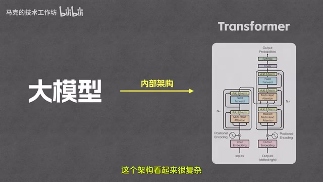

[00:00:56] Transformer 架构最早由 Google 团队在 2017 年的论文《Attention is all you need》中提出。虽然 Google 发明了“火种”，但真正引爆全世界的是 OpenAI。
[00:01:11] 2022 年底 GPT-3.5 横空出世，是第一个达到可用级别的大模型。2023 年 3 月 GPT-4 发布，将 AI 能力天花板拉到了新高度。如今，虽然 GPT 家族依然是业界标杆，但像 Claude、Gemini 等优秀后起之秀也在同台竞技。

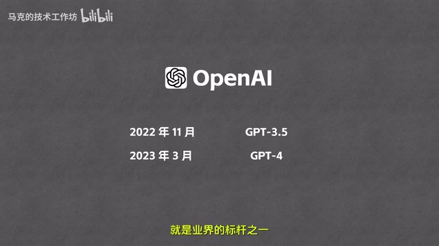

## 大模型的工作原理：文字接龙
[00:01:54] 大模型的工作本质是一个“文字接龙”游戏。
[00:02:05] 假设你提问“马克的视频怎么样”，模型接收输入后会预测下一个概率最高的词（如“特别”）。关键点在于：模型吐出“特别”后，会将其追加到原始输入后面，组成新的输入再次预测下一个字（如“的”），以此类推，直到输出一个特殊的“结束标识符”。这就是为什么大模型是一个词一个词输出答案的原因。

## Token 与 Tokenizer：人类与机器的翻译官
[00:03:06] 大模型本质上是庞大的数学函数，只处理数字（矩阵运算），不认识人类文字。因此需要 Tokenizer（分词器）作为中间人进行编码（文字转数字）和解码（数字转文字）。

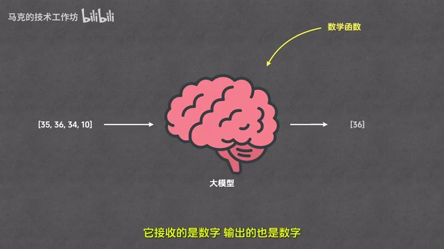

[00:03:59] **编码过程分两步：**
1. **切分**：将句子拆成最小片段，称为 Token。
2. **映射**：将每个 Token 对应到一个数字，称为 Token ID。
[00:04:41] 模型运算后输出 Token ID，Tokenizer 再通过映射将其还原为文字。
[00:05:19] **注意**：Token 并不等同于“词”。一个词可能被拆分为多个 Token（如“工作坊”可能拆为“工作”和“坊”；英文单词“helpful”拆为“help”和“ful”）。平均而言，1 个 Token 约等于 0.75 个英文单词或 1.5 到 2 个汉字。

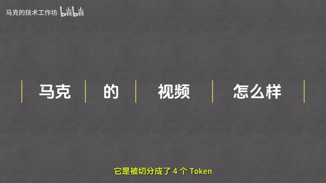

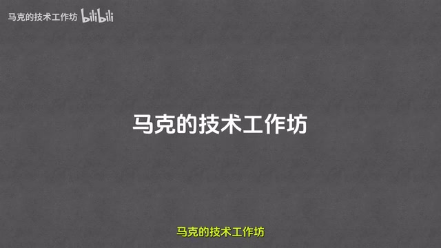

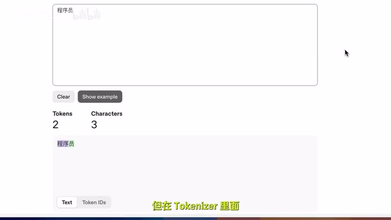

## Context 与 Context Window：AI 的临时记忆
[00:08:14] 大模型本身没有记忆，它能记住聊天记录是因为程序每次都会将之前的对话历史与新问题一起发送给模型。
[00:09:09] **Context（上下文）**：指模型每次处理任务时接收到的信息总和，包括问题、历史记录、系统提示词等。
[00:10:01] **Context Window（上下文窗口）**：指 Context 能容纳的最大 Token 数量。目前主流模型如 GPT-4o、Gemini 1.5 Pro、Claude 3.5 的窗口通常在 100 万 Token 左右，足以装下《哈利波特》全集。

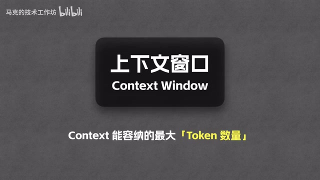

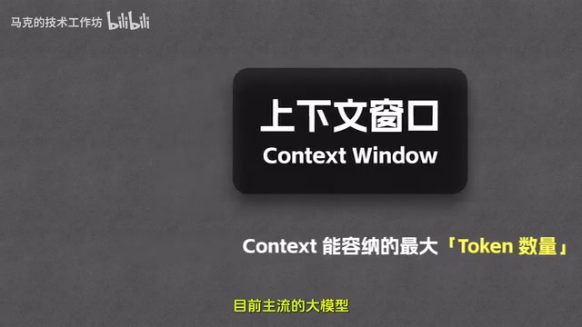

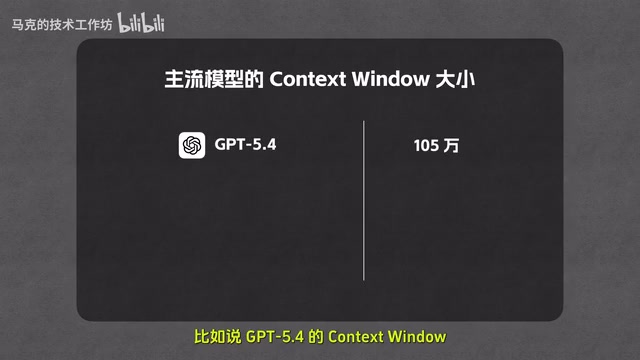

## RAG 技术：解决长文本与成本问题
[00:10:48] 如果资料（如产品手册）极长，全部塞入 Context 会导致成本过高或超出窗口限制。
[00:11:15] **RAG（检索增强生成）**：该技术从手册中抽取与问题最匹配的片段发给模型，而非整本书。这样既不受窗口限制，也能大幅降低成本。

## Prompt：提示词工程与系统指令
[00:11:45] Prompt 是给大模型的具体问题或指令。Prompt 的清晰度直接决定输出质量，由此产生了 Prompt Engineering（提示词工程）。

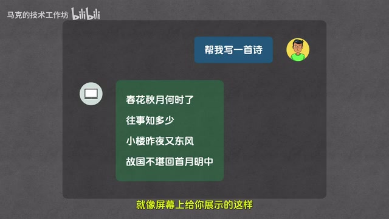

[00:13:20] **Prompt 分为两类：**

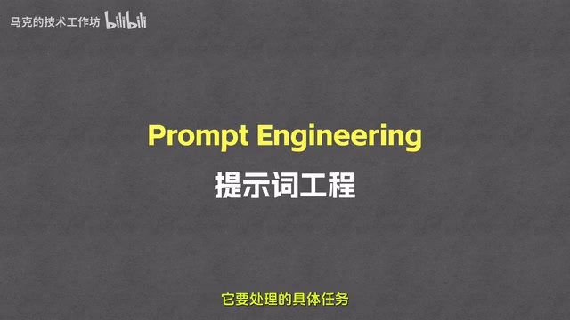

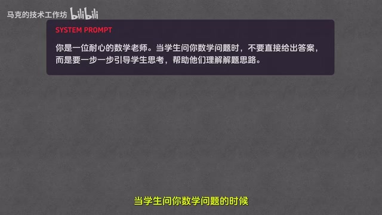

1. **User Prompt（用户提示词）**：用户在对话框输入的具体任务。
2. **System Prompt（系统提示词）**：开发者在后台配置的，用于设定 AI 的人设（如“你是一个数学老师”）和做事规则（如“不要直接给答案，要引导思考”）。

## Tool：让 AI 感知与影响外部世界
[00:15:15] 大模型无法直接感知实时信息（如天气）。Tool（工具）本质上是函数。
[00:16:18] **调用流程：**

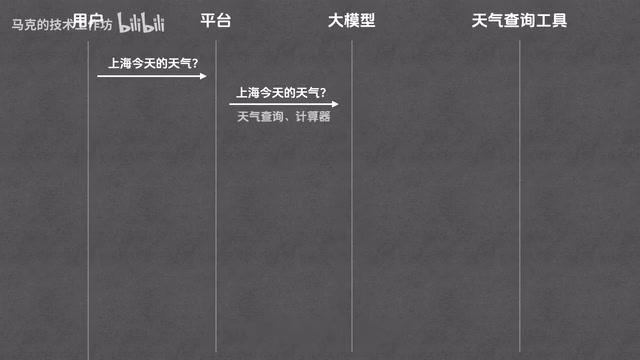

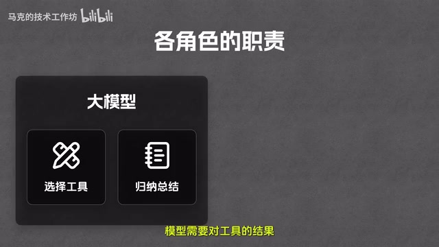

1. 用户提问，**平台**（传话筒代码）将问题和可用工具列表发给**模型**。
2. 模型分析后生成“调用指令”（包含工具名和参数）。
3. 平台接收指令并实际执行函数，获取结果。
4. 平台将结果返给模型，模型归纳总结成“人话”回复用户。
[00:18:53] **核心误区**：模型本身不能执行工具，它只能输出文本指令，实际执行由平台完成。

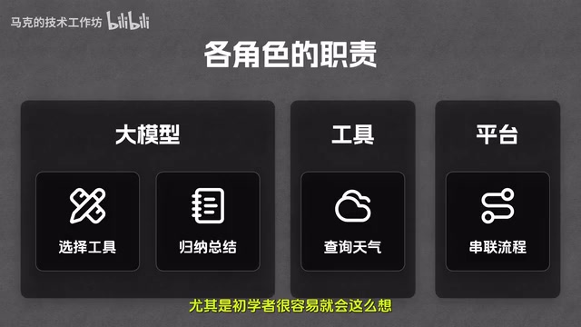

## MCP：统一的工具接入规范
[00:19:23] 以前每个平台（OpenAI、Anthropic、Google）的工具接入规范都不同，开发者需要写多套代码。

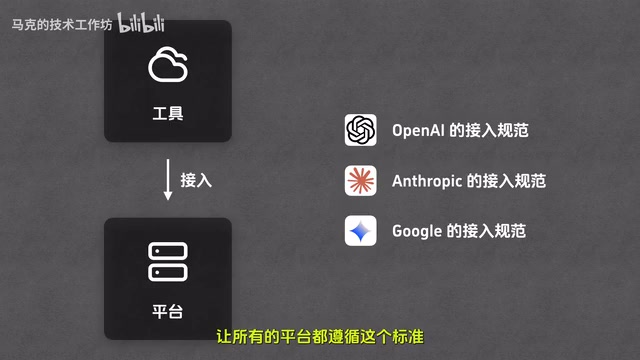

[00:20:21] **MCP（Model Context Protocol，模型上下文协议）**：这是一套统一的接入标准。开发者只需按 MCP 规范写一次工具，即可在所有支持该协议的平台上使用，类似于硬件界的 Type-C 接口。

## Agent：具备自主规划能力的智能体
[00:21:23] 当任务复杂需要多次调用工具时（如：查定位 -> 查天气 -> 找雨伞店），模型需要一步步思考并决定下一步动作。

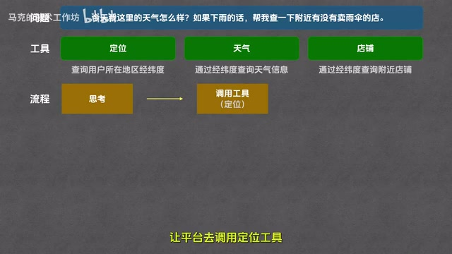

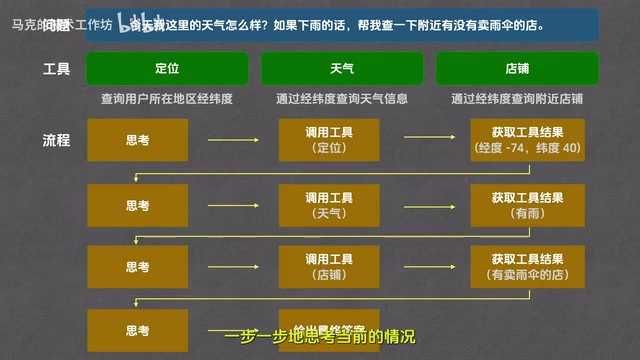

[00:23:30] **Agent（智能体）**：指能够自主规划、自主调用工具直至完成复杂任务的系统。常见的构建模式包括 ReAct、Plan and Execute 等。

## Agent Skill：定制化的技能说明书
[00:24:12] 为了避免每次都输入冗长的规则要求，可以使用 Agent Skill。它本质上是存放在特定目录下的 Markdown 说明文档（文件名必须为 `Skill.md`）。

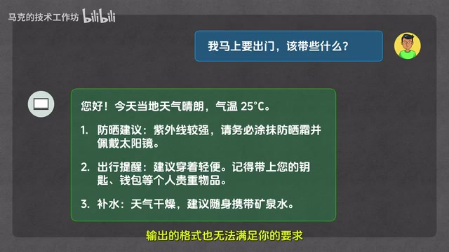

[00:25:46] **结构包含两部分：**

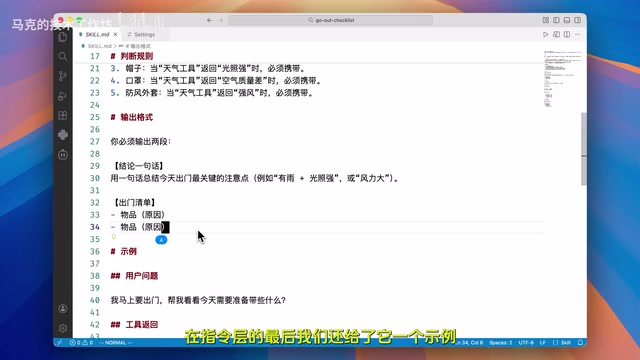

1. **元数据层**：包含 `name` 和 `description`，让 Agent 知道这是什么技能。
2. **指令层**：详细说明目标、执行步骤、判断规则和输出格式。
[00:28:36] 以 Claude Code 为例，系统启动时会扫描技能文件夹。当用户问题与技能描述相关时，Agent 会自动加载指令层，按照预设的逻辑（如调用特定 MCP 工具并按特定格式输出）完成任务。

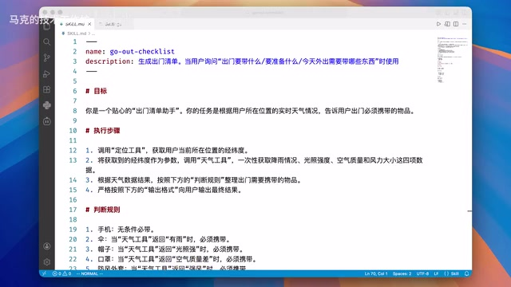

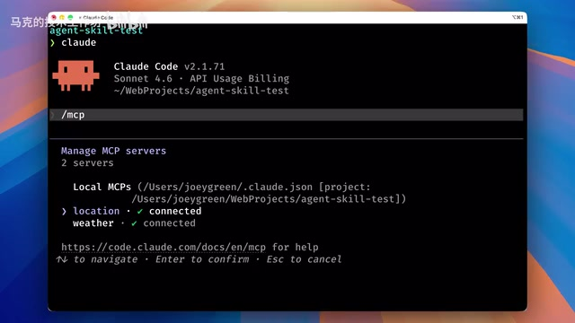

## Agent Skill 的运行机制与功能

[00:29:52] 原数据层在 Cloud Code 启动时已经加载完成。在读取到 Agent Skill 的完整内容后，Cloud Code 会按照其要求执行任务。

[00:29:59] 执行过程中，它首先请求调用定位工具，获得许可后，再请求调用天气工具。在获取所有必要信息后，Cloud Code 会将答案整理成 Agent Skill 所要求的格式并输出。

[00:30:21] Agent Skill 的基本功能可以理解为一个给 Agent 阅读的说明文档。此外，它还具备运行代码、引用资源等高级功能。其“渐进式披露机制”是一大特色，能够节省大量的 Token。

## AI 技术体系核心概念回顾

[00:30:47] 整个 AI 技术体系包含以下核心概念：

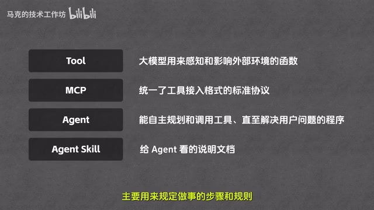

*   **LLM（大模型）**：所有 AI 技术的核心。
*   **Token**：大模型处理数据的最基本单元。
*   **Context（上下文）**：大模型每次处理任务时接收到的信息总和，可视为临时记忆体，包含历史记录、系统规则及当前输入等，其数据单位也是 Token。
*   **Context Window（上下文窗口）**：代表 Context 最多能够存储的 Token 容量。
*   **Prompt（提示词）**：用户或系统下达的具体指令或问题。分为 **User Prompt**（用户输入）和 **System Prompt**（开发者配置的人设与规则）。
*   **Tool（工具）**：大模型用来感知和影响外部环境的函数。
*   **MCP**：统一的工具接入格式标准协议。有了 MCP，开发者只需按一个标准制作工具，无需为每个模型厂商重复开发。
*   **Agent（智能体）**：能够自主规划、调用工具并持续运作，直至解决用户问题的程序。
*   **Agent Skill**：规定 Agent 做事步骤和规则的说明文档。

## 总结与展望

[00:32:07] 理解这些概念后，就能看懂 AI 领域的新技术与新产品。无论是 Cloud Code、Codex、Co-work 还是 Open Cloud，本质上都在此框架下运作。